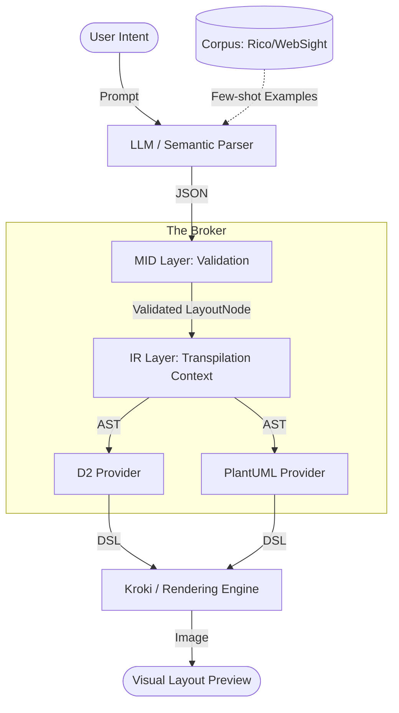

# Wireframe MCP Architecture

This document describes the core architecture of **Wireframe MCP**, focusing on the relationship between the **Corpus**, **MID**, and **IR** layers.

## Core Concepts

The system operates as a **layout broker** that transforms high-level user intent into low-level rendering code. This transformation happens in distinct stages, each with its own data model and responsibility.

### 1. The Corpus Layer (`src/corpus`)
**Role**: Data Source & Standardization
- **Responsibility**: Provides the "vocabulary" and "examples" for the system.
- **Providers**: Downloads and extracts datasets like Rico (Android), WebSight, etc.
- **Output**: Generates `StandardizedData` objects that contain raw hierarchies and, where possible, an initial mapping to the **MID** layer.

### 2. The MID Layer (`src/mid`)
**Role**: Semantic Definition (The "What")
- **Full Name**: Metadata-Intermediate-Definition
- **Responsibility**: Serves as the **Source of Truth** for UI semantics and structural rules.
- **Components**:
    - **Models**: Defines `LayoutNode`, `ComponentType` (Rico-based taxonomy), and `Orientation`.
    - **Validation**: Enforces structural health (cycle detection, unique IDs, attribute bounds).
    - **Contracts**: This is the model provided to LLMs (via JSON Schema) to constrain their output.
- **Analogy**: If the system were a language, MID would be the **Grammar and Dictionary**.

### 3. The IR Layer (`src/ir`)
**Role**: Transpilation Context (The "How")
- **Full Name**: Intermediate Representation
- **Responsibility**: Acts as a bridge between the semantic MID and the target-specific providers.
- **Function**: While currently a thin proxy for MID, the IR is where **transpilation-specific transforms** live. It prepares the semantic tree for conversion into DSLs like D2 or PlantUML.
- **Analogy**: IR is the **Translator** who takes the correct grammar (MID) and decides how to phrase it for a specific audience (DSL).

## Data Flow: From Intent to Image

## Why Separate MID and IR?

1. **Long-term Sustainability**: MID represents *universal* UI concepts (e.g., "a button inside a container"). IR represents *implementation* details for transpilers. Separating them prevents "leaking" provider-specific hacks into the core semantic model.
2. **Multi-Target Support**: A single MID definition can be translated into multiple IR contexts (e.g., an "iOS IR" vs. a "Web IR") without changing the underlying semantic validation logic.
3. **LLM Optimization**: LLMs work best with a stable, semantic MID. We can then perform complex layout optimizations in the IR layer that are too difficult for an LLM to get right consistently.

## Module Map

| Path | Purpose | Key Exports |
|------|---------|-------------|
| `src/mid/` | Semantic Source of Truth | `LayoutNode`, `ComponentType`, `validate_layout` |
| `src/ir/` | Transpilation Bridge | `export_json_schema` |
| `src/corpus/` | Data Ingestion | `BaseProvider`, `StandardizedData` |
| `src/providers/` | Transpilation Implementations | `D2Provider`, `PlantUMLProvider` |
| `src/validation/`| (Internal) Logic Proxy | Proxies to `src/mid` |
