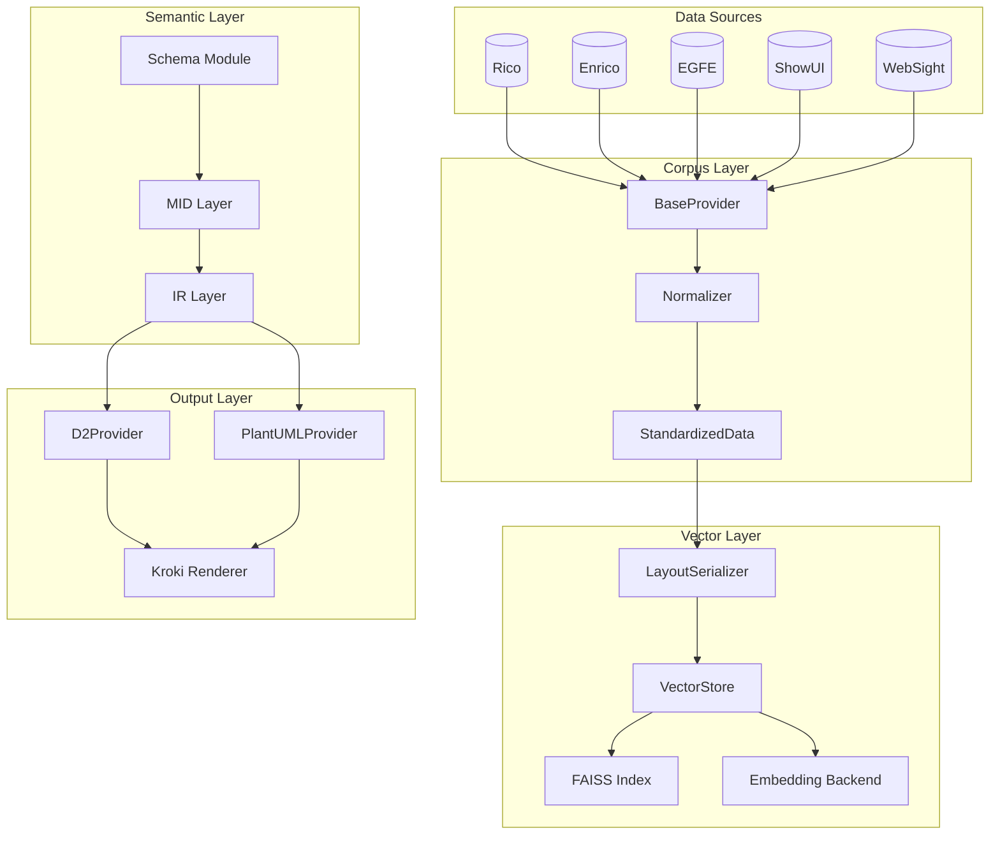
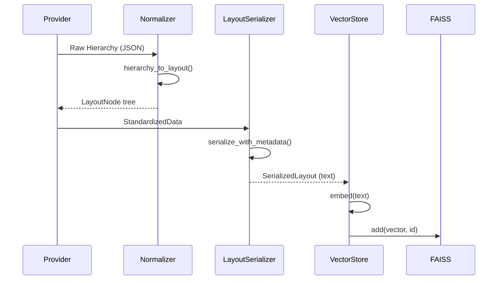
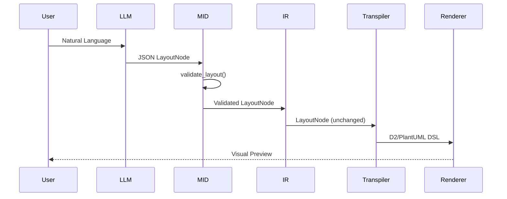
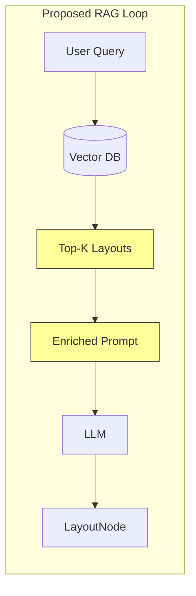
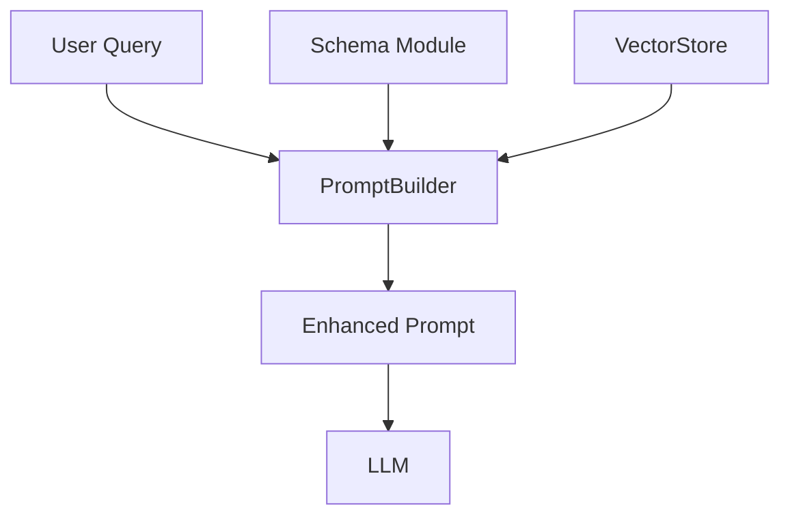

# Design Investigation: MID/IR Integration with RAG System

## Executive Summary

This document presents findings from an audit of the MID (Metadata-Intermediate-Definition) and IR (Intermediate Representation) modules, and proposes how schema data and RAG-sourced enrichment will feed into these layers to construct UI examples and standardized layout approximations.

**Principal Goal**: Transform natural language input into UI layout visualizations using standardized UI element definitions, grounded by pre-indexed vector database knowledge.

---

## Current Architecture Overview



---

## Module Audit Findings

### Schema Module ([lib.py](file:///y:/code/wireframe-mcp-worktrees/feature-investigate/src/schema/lib.py))

| Aspect | Status | Notes |
|--------|--------|-------|
| Component Taxonomy | ✅ Complete | 26 Rico-based ComponentTypes |
| Rich Metadata | ✅ Complete | ComponentMeta with descriptions, aliases, constraints |
| LLM Schema Export | ✅ Complete | [export_llm_schema()](file:///y:/code/wireframe-mcp-worktrees/feature-investigate/src/schema/lib.py#578-630) for prompt injection |
| JSON Schema Generation | ✅ Complete | Pydantic-based LayoutNodeSchema |

**Key Exports**:
- [ComponentType](file:///y:/code/wireframe-mcp-worktrees/feature-investigate/src/schema/lib.py#43-83) - 26 UI component types
- [ComponentMeta](file:///y:/code/wireframe-mcp-worktrees/feature-investigate/src/schema/lib.py#99-133) - Rich metadata per type
- [export_llm_schema()](file:///y:/code/wireframe-mcp-worktrees/feature-investigate/src/schema/lib.py#578-630) - LLM-optimized schema with examples

### MID Module ([lib.py](file:///y:/code/wireframe-mcp-worktrees/feature-investigate/src/mid/lib.py))

| Aspect | Status | Notes |
|--------|--------|-------|
| LayoutNode Model | ✅ Complete | Recursive Pydantic model for UI AST |
| Validation | ✅ Complete | Cycle detection, duplicate IDs, flex bounds |
| Schema Re-exports | ✅ Complete | Re-exports ComponentType, Orientation from schema |

**Key Exports**:
- [LayoutNode](file:///y:/code/wireframe-mcp-worktrees/feature-investigate/src/mid/lib.py#31-67) - Core recursive node model
- [validate_layout()](file:///y:/code/wireframe-mcp-worktrees/feature-investigate/src/mid/lib.py#90-159) - Structural validation
- [is_valid()](file:///y:/code/wireframe-mcp-worktrees/feature-investigate/src/mid/lib.py#161-171) - Quick validity check

### IR Module ([lib.py](file:///y:/code/wireframe-mcp-worktrees/feature-investigate/src/ir/lib.py))

| Aspect | Status | Notes |
|--------|--------|-------|
| Core Function | ⚠️ Minimal | Currently a thin proxy to MID |
| Transpilation Context | ❌ Not Implemented | Reserved for future transforms |

> [!IMPORTANT]
> **Gap Identified**: The IR layer is currently empty. Per architecture docs, it should house transpilation-specific transforms (e.g., layout optimization, provider-specific hints).

### Vector Module

| Component | Status | Notes |
|-----------|--------|-------|
| [VectorStore](file:///y:/code/wireframe-mcp-worktrees/feature-investigate/src/vector/lib.py) | ✅ Complete | Orchestrates indexing/search |
| [FAISSIndex](file:///y:/code/wireframe-mcp-worktrees/feature-investigate/src/vector/index.py) | ✅ Complete | GPU/CPU with fallback |
| [LayoutSerializer](file:///y:/code/wireframe-mcp-worktrees/feature-investigate/src/vector/serializer.py) | ✅ Complete | Schema-aware text serialization |
| Embedding Backends | ✅ Complete | Voyage AI + Local options |

### Corpus Providers

| Provider | Status | Data Types |
|----------|--------|------------|
| Rico | ✅ Complete | Hierarchy, Image, Layout |
| Enrico | ✅ Complete | Hierarchy, Layout |
| EGFE | ✅ Complete | Hierarchy, Layout |
| ShowUI | ✅ Implemented | Hierarchy, Layout |
| WebSight | ✅ Implemented | HTML, Image |

---

## Data Flow Analysis

### Current Flow: Corpus → Vector



### Current Flow: Query → Visualization



---

## Gap Analysis: Missing RAG Integration

### Current State vs. Goal

| Feature | Current | Goal |
|---------|---------|------|
| Schema in LLM Prompts | ✅ JSON Schema exported | ✅ Working |
| Few-shot Examples | ❌ Manual/static | Dynamic from Vector DB |
| RAG Context Retrieval | ❌ Not connected | Query → Top-K examples |
| Example Selection | ❌ None | Semantic similarity search |
| IR Enrichment | ❌ None | Layout hints from similar UIs |

### Missing Connection Point



> [!WARNING]
> **Critical Gap**: No mechanism exists to inject retrieved layouts into LLM prompts. The VectorStore can search, but results are not consumed by the generation pipeline.

---

## Proposed Next Steps

### Phase 1: IR Layer Enhancement

Extend IR to serve as the **transpilation context holder** with:

1. **Layout Hints**: Store optimization metadata derived from corpus analysis
2. **Provider Hints**: Target-specific rendering suggestions
3. **RAG Context**: Slot for retrieved similar layouts

```python
# Proposed IR extension
@dataclass
class TranspilationContext:
    """Context passed through transpilation pipeline."""
    node: LayoutNode
    similar_layouts: list[LayoutNode]  # From RAG
    target_provider: str
    layout_hints: dict[str, Any]  # Provider-specific hints
```

### Phase 2: RAG Prompt Injection

Create a **PromptBuilder** that:
1. Accepts user query
2. Queries VectorStore for similar layouts
3. Serializes top-K matches as few-shot examples
4. Injects schema + examples into LLM prompt



### Phase 3: Feedback Loop

Enable **refinement cycles**:
1. LLM generates initial LayoutNode
2. IR layer enriches with RAG-derived hints
3. User provides feedback on visualization
4. System refines based on corrections

---

## Recommended Implementation Order

| Priority | Task | Module | Description |
|----------|------|--------|-------------|
| 1 | Create `TranspilationContext` | IR | Context object for pipeline state |
| 2 | Implement `PromptBuilder` | New (`src/prompt/`) | RAG-aware prompt construction |
| 3 | Connect VectorStore to PromptBuilder | Integration | Wire search results to prompts |
| 4 | Add layout hints extraction | Corpus | Analyze corpus for common patterns |
| 5 | Implement feedback refinement | IR | Accept corrections, re-generate |

---

## Questions for User Review

1. **VectorStore Backend**: Should we prioritize Voyage API (higher quality) or local embeddings (offline capability) for the RAG retrieval?

2. **Few-shot Count**: How many similar layouts should we inject into prompts? (Trade-off: more examples = better grounding but higher token cost)

3. **IR Extension Scope**: Should the IR layer also handle layout optimization (e.g., merging redundant containers) or remain purely a context-holder?

4. **Feedback Format**: What form should user feedback take?
   - Natural language corrections?
   - Direct LayoutNode edits?
   - Visual annotations?
