# Providers Module

The Providers module implements **transpilation backends** that convert validated `LayoutNode` trees from the MID layer into target-specific Domain Specific Language (DSL) syntax for rendering.

## Architecture

```
┌─────────────────────────────────────────────────────────────────┐
│                      Transpilation Flow                         │
├─────────────────────────────────────────────────────────────────┤
│                                                                 │
│  ┌─────────────┐    ┌─────────────┐    ┌─────────────────────┐  │
│  │ LayoutNode  │ -> │  Provider   │ -> │  DSL Output         │  │
│  │ (from MID)  │    │  (D2 or     │    │  (Text for Kroki)   │  │
│  │             │    │   PlantUML) │    │                     │  │
│  └─────────────┘    └─────────────┘    └─────────────────────┘  │
│                            │                     │              │
│                            v                     v              │
│                    ┌─────────────┐    ┌─────────────────────┐   │
│                    │ Base        │    │  Kroki Renderer     │   │
│                    │ Provider    │    │  (PNG/SVG output)   │   │
│                    └─────────────┘    └─────────────────────┘   │
│                                                                 │
└─────────────────────────────────────────────────────────────────┘
```

## Available Providers

| Provider | Path | Status | Use Case |
|----------|------|--------|----------|
| **D2Provider** | `providers/d2/` | ✅ Complete | Primary - clean architectural diagrams |
| **PlantUMLProvider** | `providers/plantuml/` | ✅ Complete | Fallback - sketchy wireframe aesthetic |

## Usage

```python
from src.mid import LayoutNode, ComponentType, Orientation
from src.providers.d2 import D2Provider
from src.providers.plantuml import PlantUMLProvider

# Create a layout
root = LayoutNode(
    id="dashboard",
    type=ComponentType.CONTAINER,
    orientation=Orientation.HORIZONTAL,
    children=[
        LayoutNode(id="sidebar", type=ComponentType.DRAWER, flex_ratio=3),
        LayoutNode(id="main", type=ComponentType.CONTAINER, flex_ratio=9),
    ],
)

# Transpile to D2
d2 = D2Provider()
dsl_output = d2.transpile(root)
print(dsl_output)

# Transpile to PlantUML Salt
puml = PlantUMLProvider()
salt_output = puml.transpile(root)
print(salt_output)
```

---

## DSL Evaluation Research

This section documents the rationale for DSL selection.

### Candidates Evaluated

| DSL | Purpose | Strengths | Limitations |
|-----|---------|-----------|-------------|
| **D2** | Text-to-diagram | Nested containers, constraint-based layout, multiple engines | Stricter syntax |
| **PlantUML Salt** | GUI wireframes | High tolerance for errors, sketchy aesthetic | Limited positioning |
| **Slint** | Production UI | Full spatial control, live preview | Too complex for wireframes |
| **Excalidraw** | Hand-drawn diagrams | JSON format (LLM-friendly) | Manual positioning, no auto-layout |

### Evaluation Matrix

| Criterion | PlantUML Salt | D2 | Slint | Excalidraw |
|-----------|:-------------:|:--:|:-----:|:----------:|
| Containment | ✓ | ✓✓ | ✓✓ | ✓ |
| Hierarchy | ✓ | ✓✓ | ✓✓ | ✓ |
| Spatial Intent | Limited | Strong | Full | Manual |
| LLM Tolerance | High | Medium | Low | High |
| Visual Clarity | Sketchy | Clean | High | Hand-drawn |
| Auto-Layout | Basic | Yes | Yes | No |
| Kroki Support | Yes | Yes | No | Yes |

### Selection Rationale

**D2 (Primary)**: Selected for its **constraint-based layout engine** that explicitly models containers and connections, aligning 1:1 with CSS Flexbox/Grid systems.

**PlantUML Salt (Fallback)**: Offers high tolerance for LLM output variations and a sketchy, low-fidelity wireframe aesthetic ideal for early-stage design.

---

## D2 Provider

### Features

- Container nesting with `{ }` syntax
- Direction hints via `direction: right/down`
- Width percentages derived from `flex_ratio`
- Label rendering from node labels

### Output Example

```d2
dashboard: Dashboard {
  direction: right
  
  sidebar: Navigation {
    width: 25%
  }
  
  main: Content Area {
    width: 75%
  }
}
```

### Mapping

| LayoutNode Property | D2 Syntax |
|---------------------|-----------|
| `orientation: HORIZONTAL` | `direction: right` |
| `orientation: VERTICAL` | `direction: down` |
| `flex_ratio` | `width: {percentage}%` |
| `label` | Shape label |
| `children` | Nested blocks |

---

## PlantUML Salt Provider

### Features

- Brace styles for layout hints:
  - `{#` for grid layouts (horizontal)
  - `{+` for tabbed panels
  - `{` for vertical grouping
  - `{S` for scrollable areas
  - `{^` for titled containers
- Component-specific rendering (buttons `[]`, checkboxes `[X]`, etc.)
- Sketchy wireframe aesthetic

### Output Example



```plantuml
@startsalt
{
  {# Navigation | Content Area }
  ---
  { [Submit] | [Cancel] }
}
@endsalt
```

### Component Rendering

| ComponentType | Salt Syntax |
|---------------|-------------|
| `button` | `[Button Label]` |
| `checkbox` | `[X] Label` or `[ ] Label` |
| `radio_button` | `(X) Label` or `( ) Label` |
| `input` | `"Input text"` |
| `text` | Plain text |
| `slider` | `{SL ...}` |

---

## Rendering Backend

### Kroki (Recommended)

Kroki provides a **unified HTTP API** for rendering multiple diagram types:

```bash
# Self-hosted via Docker
docker run -p 8000:8000 yuzutech/kroki
```

**Supported formats**: SVG, PNG, PDF, JPEG

**Integration**:
```python
from src.render import RenderClient, RenderConfig

client = RenderClient(base_url="http://localhost:8000")
config = RenderConfig(format="svg", theme="default")

# Render D2
svg_bytes = await client.render("d2", d2_code, config)

# Render PlantUML
png_bytes = await client.render("plantuml", salt_code, config)
```

### Direct CLI (Alternative)

For environments without Kroki:

```bash
# D2
d2 input.d2 output.svg

# PlantUML
java -jar plantuml.jar input.puml
```

---

## References

- [D2 Language Documentation](https://d2lang.com/)
- [PlantUML Salt Documentation](https://plantuml.com/salt)
- [Kroki Diagram Server](https://kroki.io/)
