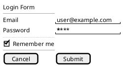

# Provider Capability Audit: LayoutNode vs D2 vs PlantUML Salt

## Executive Summary

This audit reveals significant **capability mismatches** between our internal LayoutNode representation and what D2/PlantUML can actually render. The current transpilation loses substantial information.

---

## 1. CAPABILITY MATRIX

### Layout Properties

| Property | LayoutNode | D2 Support | PlantUML Support | Data Loss? |
|----------|------------|------------|------------------|------------|
| `orientation: horizontal` | ✅ Full | ✅ `direction: right` | ⚠️ `{#` brace + pipe join | **YES** - PlantUML forces table syntax |
| `orientation: vertical` | ✅ Full | ✅ Default (down) | ✅ `{` with line stacking | No |
| `orientation: overlay` | ✅ Full | ❌ Not supported | ❌ Not supported | **YES** - Complete loss |
| `flex_ratio` (1-12) | ✅ Full | ⚠️ Comment hint only | ❌ Ignored | **YES** - Both providers |
| `width` (px/%) | ✅ Full | ⚠️ Grid containers only | ❌ Not supported | **YES** - PlantUML |
| `height` (px/%) | ✅ Full | ⚠️ Grid containers only | ❌ Not supported | **YES** - PlantUML |
| `gap` (px) | ✅ Full | ✅ `grid-gap` | ⚠️ `.` spacer cells | Partial - semantic loss |
| `padding` (px) | ✅ Full | ❌ Comment hint only | ⚠️ `skinparam padding` | **YES** - D2 |
| `align` (cross-axis) | ✅ 4 values | ⚠️ `near` (9 positions) | ❌ Not supported | **YES** - Both providers |
| `justify` (main-axis) | ✅ 6 values | ❌ Not supported | ❌ Not supported | **YES** - Complete loss |
| `align_content` | ✅ 6 values | ❌ Not supported | ❌ Not supported | **YES** - Complete loss |
| `align_self` | ✅ 5 values | ❌ Not supported | ❌ Not supported | **YES** - Complete loss |
| `wrap` | ✅ 2 values | ❌ Not supported | ❌ Not supported | **YES** - Complete loss |
| `scrollable` | ✅ Boolean | ❌ Not supported | ✅ `{S`, `{SI`, `{S-` | **YES** - D2 |

### Text Styling

| Property | LayoutNode | D2 Support | PlantUML Support | Data Loss? |
|----------|------------|------------|------------------|------------|
| `text_size` (4 levels) | ✅ Full | ✅ `font-size: 8-100` | ✅ `<size:N>` | No |
| `text_weight` (3 levels) | ✅ Full | ✅ `bold: true` | ✅ `<b>` | No |
| `text_transform` | ✅ 4 values | ✅ `text-transform` | ✅ Manual case change | No |
| `text_align` | ✅ 3 values | ⚠️ `near` (limited) | ❌ Not supported | **YES** - PlantUML |
| `semantic_color` (7) | ✅ Full | ✅ `font-color` | ✅ `<color:Name>` | No |

### Component Types

| Category | LayoutNode Types | D2 Rendering | PlantUML Rendering |
|----------|------------------|--------------|---------------------|
| **Containers** | CONTAINER, CARD, MODAL, WEB_VIEW | Generic shapes | `{`, `{^`, `{*` |
| **Navigation** | TOOLBAR, NAVBAR, BOTTOM_NAV, DRAWER, TAB_BAR, MULTI_TAB, PAGER_INDICATOR, MENU_BAR, TREE | Generic shapes | `{/`, `{*`, `{T`, `{+` |
| **Content** | TEXT, IMAGE, LIST_ITEM, ICON, ADVERTISEMENT | Labels + shapes | `"text"`, `<&icon>` |
| **Controls** | BUTTON, TEXT_BUTTON, INPUT, CHECKBOX, RADIO_BUTTON, SWITCH, SLIDER, SPINNER, DATE_PICKER, NUMBER_STEPPER, DIVIDER | Labels (no semantics) | `[btn]`, `"input"`, `[X]`, `()`, `^dropdown^`, `--` |

---

## 2. DATA LOSS ANALYSIS

### Critical Loss (Completely Ignored)

| Property | Impact | Notes |
|----------|--------|-------|
| `orientation: overlay` | Z-axis stacking lost | Neither provider supports |
| `justify` | Distribution algorithm lost | No CSS justify-content equivalent |
| `align_content` | Multi-line alignment lost | No equivalent in either |
| `align_self` | Per-item override lost | No equivalent in either |
| `wrap` | Overflow behavior lost | No equivalent in either |

### Significant Loss (Comment/Hint Only)

| Property | D2 | PlantUML | Notes |
|----------|-----|----------|-------|
| `flex_ratio` | `# width: X%` comment | Ignored | D2 hint not rendered |
| `padding` | `# layout: padding=X` | `skinparam padding` | Different semantics |
| `align` | Limited `near` positions | Ignored | D2 has 9 positions vs 4 values |

### Partial Loss (Semantic Mismatch)

| Property | Issue |
|----------|-------|
| `gap` | D2 uses `grid-gap`, PlantUML uses `.` spacers - different visual results |
| Horizontal orientation | D2 uses `direction: right`, PlantUML forces `{#` table with pipes |

---

## 3. PROVIDER IMPLEMENTATION ISSUES

### Current D2Provider Problems

1. **Width as Comment**: `flex_ratio` converted to `# width: X%` which Kroki ignores
2. **No Grid Mode**: D2 has explicit grid support (`grid-rows`, `grid-columns`) that we don't use
3. **No Style Attributes**: D2 supports `fill`, `stroke`, `border-radius` etc. that we ignore
4. **Limited Shape Usage**: Only using generic containers, not D2's 18+ shapes

### Current PlantUMLProvider Problems

1. **Indent Hack**: Using `indent + 0` for horizontal layouts instead of proper Salt syntax
2. **Forced Table Mode**: All horizontal layouts become `{#` tables regardless of intent
3. **No Width Support**: `flex_ratio` completely lost
4. **No Alignment**: Salt has no alignment, but we could use padding/spacers

---

## 4. D2 FEATURES WE SHOULD USE

### Grid Layout (Not Currently Used)
```d2
container: {
  grid-rows: 2
  grid-columns: 3
  horizontal-gap: 10
  vertical-gap: 10

  a
  b
  c
  d
  e
  f
}
```
This would be **far better** for representing flex layouts than `direction: right`.

### Style Attributes (Not Currently Used)
```d2
button: Click Me {
  style: {
    fill: "#3B82F6"
    stroke: "#1D4ED8"
    border-radius: 8
    font-size: 14
    bold: true
  }
}
```

### Shape Types (Not Currently Used)
- `rectangle` (default) - for containers
- `page` - for cards
- `document` - for content
- `cylinder` - for data storage
- `person` - for user representations

---

## 5. PLANTUML FEATURES WE SHOULD USE BETTER

### Proper Container Types
| LayoutNode Type | Current | Should Be |
|-----------------|---------|-----------|
| CONTAINER | `{` | `{` or `{^` if labeled |
| CARD | `{` | `{^` (group box) |
| MODAL | `{` | `{*` (window frame) |
| TAB_BAR | `{#` | `{/` (tabs) |
| TREE | `{+` | `{T` (tree widget) |
| DATA_GRID | `{#` | `{#` (correct) |
| scrollable | `{` | `{S`, `{SI`, `{S-` |

### Widget Syntax (Underutilized)


---

## 6. RECOMMENDED CHANGES

### A. LayoutNode Schema Changes

1. **Add `display` property**: `flex | grid | block` to distinguish layout modes
2. **Add `grid_columns`/`grid_rows`**: For explicit grid layouts (maps to D2 grid)
3. **Remove unused properties**: `align_content`, `align_self` if never rendered
4. **Add provider hints**: Optional `d2_shape`, `salt_brace` for explicit control

### B. D2Provider Rewrite

1. **Use Grid Mode**: Switch from `direction: right` to proper `grid-columns`/`grid-rows`
2. **Emit Styles**: Use `style: { }` block for visual properties
3. **Map Components to Shapes**: Use semantic shapes (`page`, `document`, etc.)
4. **Remove Comment Hints**: If it can't be rendered, don't emit it

### C. PlantUMLProvider Rewrite

1. **Fix Indent Logic**: Use consistent `indent + 1` for all children
2. **Smart Brace Selection**: Map LayoutNode types to appropriate Salt braces
3. **Use Line Separators**: `--`, `..`, `==` for semantic divisions
4. **Proper Gap Handling**: Use empty cells with calculated size

---

## 7. LOSSLESS TRANSPILATION STRATEGY

### Tier 1: Core Layout (Must Preserve)
- `orientation` → Direct mapping (D2: direction, PlantUML: brace + orientation)
- `children` → Proper nesting in both
- `gap` → D2: grid-gap, PlantUML: spacer cells

### Tier 2: Visual Styling (Best Effort)
- `text_*` properties → Both support, should preserve
- `semantic_color` → Both support via colors
- `scrollable` → PlantUML only

### Tier 3: Layout Control (Provider-Specific)
- `flex_ratio` → D2 grid distribution, PlantUML table columns
- `align`/`justify` → D2 limited, PlantUML none
- `padding` → D2 none, PlantUML skinparam

### Tier 4: Unsupported (Document Loss)
- `overlay` orientation
- `wrap` behavior
- `align_self`, `align_content`

---

## 8. NEXT STEPS

1. **Decide on Schema Changes**: Do we add grid mode? Remove unused properties?
2. **Rewrite D2Provider**: Use grid layout, proper styles
3. **Rewrite PlantUMLProvider**: Fix indent logic, proper brace mapping
4. **Add Transpilation Warnings**: Emit warnings when data will be lost
5. **Create Test Suite**: Verify lossless round-trip where possible
